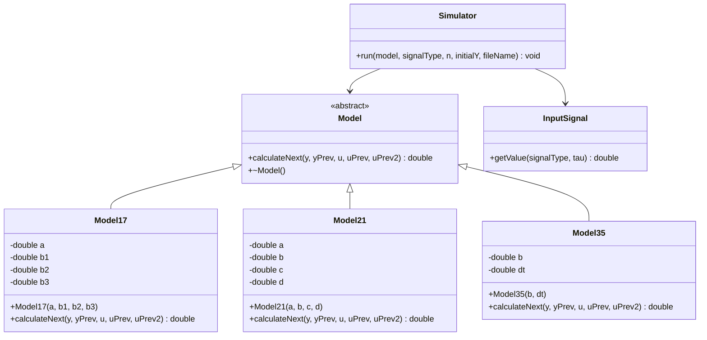
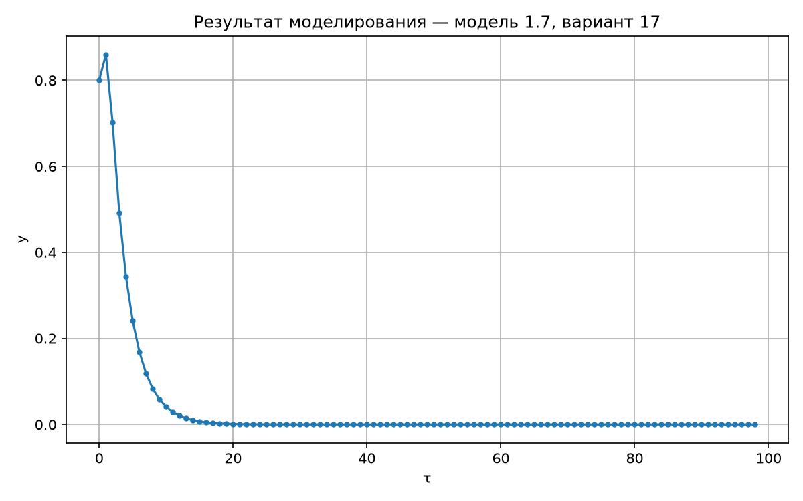
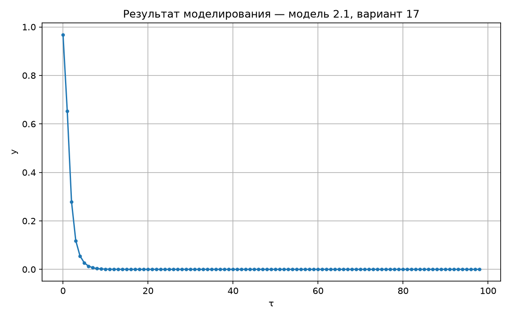
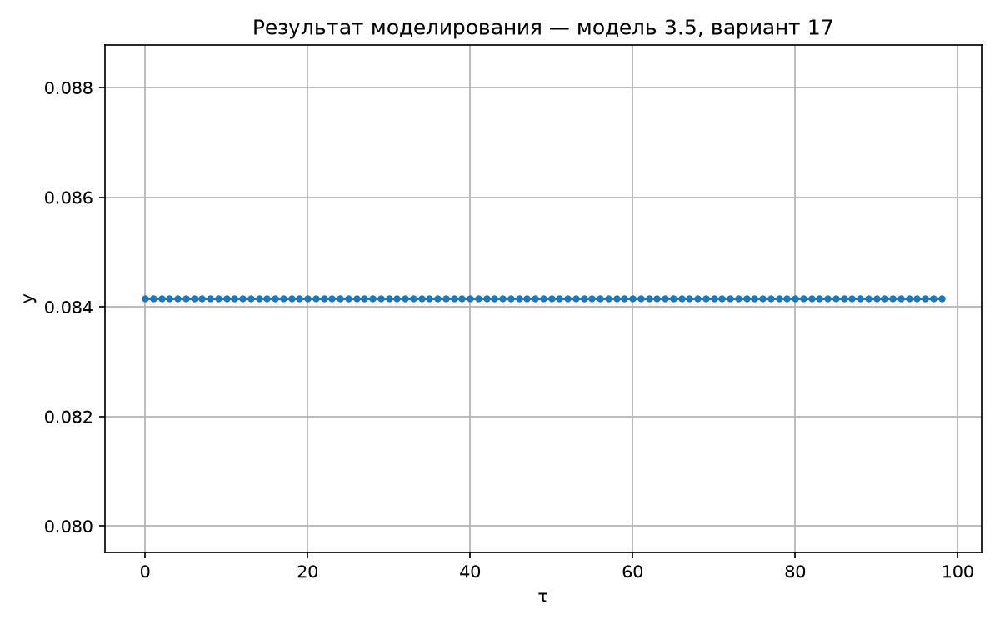
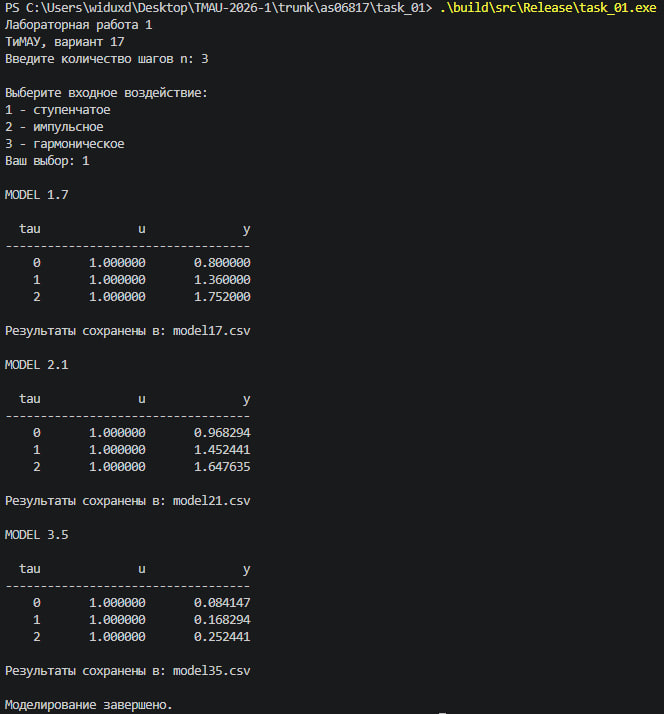

<p align="center"> Министерство образования Республики Беларусь</p>
<p align="center">Учреждение образования</p>
<p align="center">“Брестский Государственный технический университет”</p>
<p align="center">Кафедра ИИТ</p>
<br><br><br><br><br><br><br>
<p align="center">Лабораторная работа №1</p>
<p align="center">По дисциплине “Теория и методы автоматического управления”</p>
<p align="center">Тема: “Моделирования температуры объекта”</p>
<br><br><br><br><br>
<p align="right">Выполнил:</p>
<p align="right">Студент 3 курса</p>
<p align="right">Группы АС-68</p>
<p align="right">Хомич М. А.</p>
<p align="right">Проверил:</p>
<p align="right">Дворанинович Д. А.</p>
<br><br><br><br><br>
<p align="center">Брест 2026</p>


## 1. Цель работы

Цель лабораторной работы — разработать программу для моделирования математических моделей с различными входными воздействиями.

В ходе работы необходимо было реализовать несколько моделей, организовать их запуск через общий интерфейс, добавить различные типы входных сигналов, сохранение результатов и построение графиков.

---

## Задание

Для варианта 17 реализованы три модели:

**Модель 1.7:**

```text
y(t+1) = a·y(t) + b1·u(t) + b2·u(t-1) + b3·u(t-2)
```

**Модель 2.1:**

```text
y(t+1) = a·y(t) - b·y(t-1)^2 + c·u(t) + d·sin(u(t-1))
```

**Модель 3.5:**

```text
y(t+1) = y(t) + dt·b·sin(u(t))
```

## Входные воздействия

Программа поддерживает три типа сигналов:

1. Ступенчатый: `u(t) = 1`
2. Импульсный: `u(0) = 1`, далее `u(t) = 0`
3. Гармонический: `u(t) = sin(t)`

Количество шагов `n` задаётся пользователем при запуске.

## Структура программы

Для реализации моделей используется абстрактный класс `Model` с виртуальным методом `calculateNext()`.

От него наследуются:

* `Model17`;
* `Model21`;
* `Model35`.

Класс `Simulator` выполняет моделирование, а `InputSignal` формирует входные воздействия.

Результаты выводятся в консоль и сохраняются в CSV-файлы:

```text
model17.csv
model21.csv
model35.csv
```

## UML



## Визуализация

По полученным CSV-файлам строятся графики с помощью Python и Matplotlib:
### Модель 17

### Модель 21

### Модель 35


## Работа программы



## Сборка и запуск

Сборка выполняется через:

```text
build.bat
```

Используются CMake и C++.

После сборки программа запрашивает количество шагов и тип входного сигнала, после чего выполняет моделирование трёх моделей.

## Вывод

В результате была создана программа моделирования для с использованием ООП, CMake, CSV и графической визуализации результатов.
